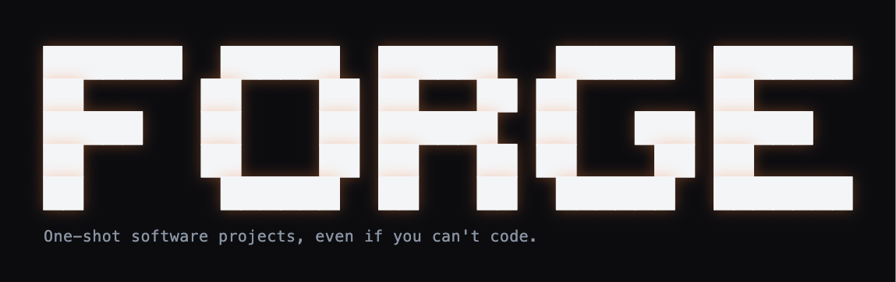
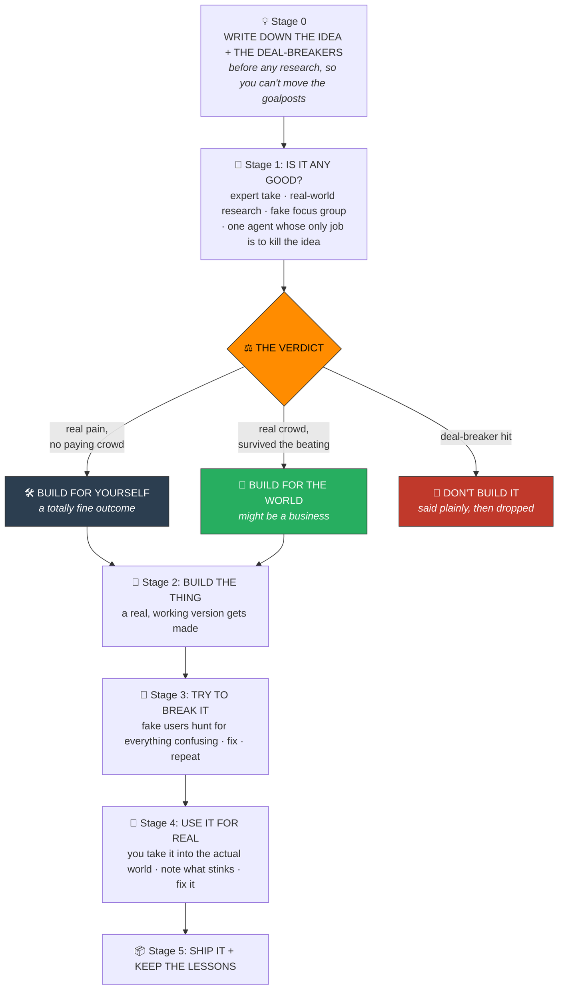

<div align="center">



### The AI that builds your idea. And tells you if it's a bad one first.

**It told its own maker no. It'll do the same for you.**

*You've got an idea for an app, a website, a tool, whatever. You're not a programmer (or you are, and you're tired). Forge takes the idea and hands you back something real, tested, and worth showing people. The twist: before it builds a single thing, it checks whether you should build it at all. Sometimes the answer is no. It'll tell you. For free. To your face.*


[](https://github.com/open-gsd/gsd-core)


</div>

---

## The mess Forge cleans up

Right now, building something with AI usually goes like this:

1. You type a giant wall of text at a chatbot.
2. You cross your fingers.
3. It gives you something that's 70% right and 30% cursed.
4. You try to fix it. It breaks something else. Back to step 3. Forever.

It's slow, it's maddening, and here's the kicker: you might be grinding through all of that to build something nobody actually wanted.

**Forge knows the right order to do things in, so you don't have to.** It asks the smart questions first, does the homework, and quietly runs your idea past a fake focus group, all *before* it writes one line of code. The thrash never gets a chance to start.

You bring the idea and the gut calls. Forge brings the plan, the build, and the reality checks.

---

## It will tell you "no." On purpose. It's kind of the best part.

Every other build tool has exactly one goal: get you to build, because building is how they get paid. So they cheer. *Amazing idea! So brave! Ship it!*

Forge isn't selling you anything, so it can just be honest. Every idea walks out one of three doors:

🛠️ **Build it for yourself.** The pain is real and it's yours, but there's no crowd out there waiting to pay for it. Cool. Build it, use it, get on with your life. Don't quit your job over it.

🚀 **Build it for the world.** There are real people, already gathered somewhere, already spending money or duct-taping a workaround. This one might actually be a business.

🛑 **Don't build it.** Somebody already made it for free, or it's a legal headache, or the idea just doesn't hold up to a hard look. Way better to hear that now than after three lost weekends.

Two times it actually did this:

- **We pointed Forge at Forge.** Before we released it, we ran the tool on itself. It came back with "build it for yourself, not the world," for one gloriously humbling reason: nobody except the person who made it had actually used it yet. The fake focus group even named the exact kind of user we should stop chasing. The tool told its own creator to sit down. That is the whole point of the thing.
- **A little compliance-reminder app.** Genuinely handy, genuinely annoying to live without. But the research dug up a free thing that already did the job. Verdict: keep it for yourself, don't try to sell it. That saved weeks of shoving a boulder uphill.

You can always overrule it. It just won't flatter you to keep you happy.

---

## "Hang on, a fake focus group? That sounds made up."

Totally fair. Here's why it isn't snake oil:

- **The fake customers are built from real ones.** Forge reads actual reviews, actual forum rants, actual questions real people asked about your kind of product, and builds its test crowd out of all that. They gripe the way your real market gripes, not the way a chirpy robot does.
- **It counts the crowd honestly.** Your own opinion gets weighted at its true size (small), not cranked up just because you're excited. An idea can't "win" simply because the simulation liked it.
- **It's a smoke alarm, not the fire department.** The fake audience is there to catch obvious duds and surface the real objections early, before you burn actual people's goodwill. The real test is Stage 4, where you use the thing out in the world. That step is not skippable.
- **And no, it's not magic. We checked.** Grounded fake audiences land around [85 percent as reliable as asking a real person the same thing twice](references/synthetic-audience-evidence.md). That gets you to the starting line fast and cheap. Real humans carry you the rest of the way.

Oh, and Forge is free and open-source, and so is everything it uses. No paid tier, no "upgrade to unlock," nothing to buy. If it felt too good and you were bracing for the catch, there isn't one.

---

## What actually happens, start to finish

None of this is busywork. It's the cheap stuff done first, so the expensive stuff (building) only ever happens to an idea that earned it.



In plain words:

0. **Jot down the idea and your deal-breakers first**, so the bar can't quietly bend later to fit whatever you find.
1. **Find out if it's any good.** An expert take, real research, the fake focus group, and one agent whose entire personality is trying to kill your idea. Out pops one of the three verdicts.
2. **Build it.** This is where an actual working thing shows up.
3. **Try to break it.** Simulated users, including someone using a screen reader (because not everyone points and clicks), walk through it looking for anything clunky. It gets fixed until it's smooth.
4. **Use it for real.** You take it into the actual world and write down what drove you nuts. Then that gets fixed too.
5. **Ship it, and keep what you learned.**

---

## Try it in five minutes

Forge lives inside [Claude Code](https://claude.com/claude-code). That's the one techy sentence, I promise.

```bash
git clone https://github.com/AdamGarceau/forge.git
cd forge && ./install.sh
```

Then you just... talk to it:

> "I have an idea for an app that helps dog walkers keep track of clients."
>
> "Should I build a tool that plans my meals for the week?"
>
> "Is this even worth building?"

You never have to say the word "Forge." It notices you're about to build something and quietly takes the wheel.

New here? [QUICKSTART.md](QUICKSTART.md) runs the whole thing on an example in five minutes. The one-time setup (a free download or two) lives in [SETUP.md](SETUP.md).

---

## Forge + GSD, in one breath

Forge doesn't reinvent the actual building. For that it leans on [GSD](https://github.com/open-gsd/gsd-core), a free tool that turns a plan into working, tested code.

Picture it like this: GSD is a very good contractor. Forge is the part that makes sure you're building a house someone wants to live in, then walks through it afterward to check that the doors actually close.

The installer offers to add GSD for you. Highly recommended, completely optional (Forge builds fine on its own), and not affiliated. They just get along.

---

## Under the hood, for the builders

Not your first rodeo? Here's what's actually happening, minus the hand-holding.

**Forge wraps your build, it doesn't replace it.** You keep your setup. Forge is Stages 0-1 in front and 3-5 behind; the build itself (Stage 2) hands off to GSD or your existing Claude Code flow and respects your `.planning/` state. Nothing to abandon. Slogan version: *Forge is Step 0. GSD is the build.*

**The "fake focus group" is grounded, not vibes.** This is the part skeptics rightly poke at, so here's the actual mechanism:

- A research pass mines real reviews, forum threads, and Q&A for your category and pulls the *verbatim* language real buyers use: the actual objections, the exact situations that trigger a purchase.
- The personas are built from that indexed language, then weighted by population share (your own persona included at its real, small size). They argue like the market, not like a helpful assistant reflecting your own bias back at you.
- It runs on **local, free models** (Ollama by default, or hosted Claude if you'd rather), so it's a cheap filter you can run a hundred times, not a metered API you're scared to touch.
- One of the agents is named **Reggie**. Reggie's entire job is to hate your idea and try to kill it. Reggie is an a-hole. But he's the good kind of a-hole, the coworker who doesn't want you to fail, not the yes-man who lets you find out the hard way. If Reggie can't kill your idea, that's the signal. If he can, better now than after you shipped.

**It's a filter, not an oracle.** The synthetic pass catches obvious losers and surfaces objections before you spend real-user goodwill. The only real check is Stage 4, a field test with actual humans, and Forge won't let you pretend you skipped it.

**The tooling is plain and readable.** The synthetic-audience scripts are a couple hundred lines of stdlib Python plus curl. Open them, read the exact prompt they send, fork them if your question set is different. No black box, no lock-in.

---

## Where it came from

Forge was reverse-engineered from three things that genuinely worked:

- **[DEADRECKON](examples/deadreckon.md)**: an offline Army map app, built from a photo of a field manual, over lunch, from a phone. It went through the entire gauntlet and held up out in the field. This is the proof.
- **A compliance tracker** whose own review politely said, "yeah, keep this one to yourself."
- **Nudge**: a real, live app, built in 266 tiny checked steps. The proof it holds up on something serious.

---

<div align="center">

*Built by [Adam Garceau](https://github.com/AdamGarceau). Forged, not vibe-coded.*

</div>
