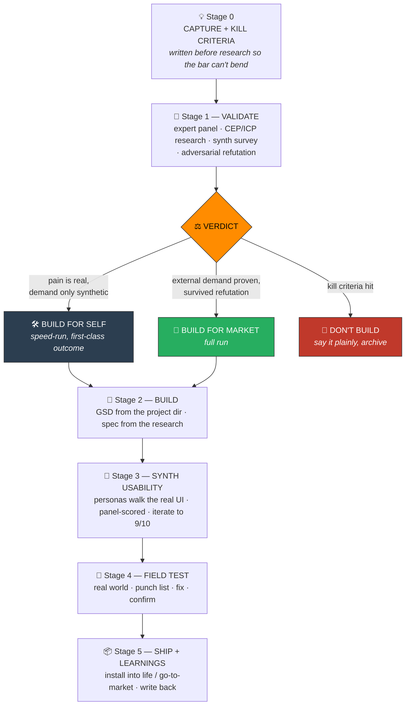

<div align="center">


### One-shot software projects, even if you can't code.

*Websites, apps, tools, anything software. You make one request; Forge does the research, the validation, the build, and the testing, so you skip the prompt → hope → fix → fix → fix loop.*

**What you get is a validated MVP, not a finished business.** Forge takes you from idea to something real, tested, and worth launching — fast and cheap. What it saves you is the expensive mistake of building and launching the *wrong* thing. It does not replace real customers voting with their wallets; nothing does. Synthetic audiences get you accurately to the starting line ([the research says grounded ones hit ~85% of a person's own test-retest reliability](references/synthetic-audience-evidence.md)); real people, real testing, and real sales take it to 100%. That honesty is the point — Forge is the fastest cheap path to an MVP you'd actually be willing to put in front of humans.


[](https://github.com/open-gsd/gsd-core)


*Decide whether to build it at all, build it right, then prove it in the real world.*

> **"One-shot" means one shot for you, not one prompt for the machine.** You fire once. Behind the gate, Forge runs the full pipeline and iterates for you — the thrash happens inside the system instead of in your lap.

> **The catch (and the moat): a one-shot is only as good as what Claude has to work with.** A build one-shots cleanly when an authoritative source already defines what "correct" means, like a manual, a standard, or a spec. Something genuinely novel that only *you* understand needs you to teach it first; you can't one-shot what there's no information about. The flip side is the advantage: **feed it a resource nobody else has**, your own manual, your customer call data, your domain expertise written down, and you get a result nobody else can. See [`references/input-context-tiers.md`](references/input-context-tiers.md).

</div>

---

## Why Forge exists

Most AI build tools assume two things a non-coder can't: that the idea is worth building, and that someone knows what "good" looks like. Forge adds the two gates that are usually missing — an **honest validation gate at the front** (should you build this, and for whom) and a **field-test gate at the back** (does it survive real users) — so you go from a raw idea to working, field-verified **software of any kind** (a website, a web app, a native app, a tool, an automation, a dashboard) without holding the system in your head or getting told what you want to hear. For the build itself in the middle, it's designed to run on [GSD](https://github.com/open-gsd/gsd-core) — highly recommended and auto-offered at install, though optional (Forge falls back to a direct build without it).

> **The point:** the founder who built his company's website the hard way — solo, saving ~$20K and months over a web-dev firm — shouldn't have to do it the hard way again. Forge is that whole process, packaged: describe what you need, and it validates, builds, tests, and field-proves it, whatever kind of software it is.

It was reverse-engineered from three builds that actually worked:

- **[DEADRECKON](examples/deadreckon.md)** — an offline Army land-nav app built from a photo of a field manual, over lunch, from a phone. Ran the full validation-and-usability gauntlet and field-tested precise. *This is the proof.*
- **A personal compliance tracker** — a tool whose validation honestly returned *build for self, not market* instead of flattering the founder.
- **Nudge** — 266 atomic commits across 16 GSD phases with verification and human-UAT gates. The build backbone.

---

## The pipeline



---

## The three verdicts (the honest part)

Most "validation" tells the founder what they want to hear. Forge is built to refuse. Every idea exits Stage 1 as exactly one of:

| Verdict | What it means | What earns it |
| --- | --- | --- |
| 🛠️ **BUILD FOR SELF** | The pain is real and yours, but demand evidence is missing or only synthetic. **A first-class outcome, not a consolation.** | Real personal pain + a build small enough to justify itself |
| 🚀 **BUILD FOR MARKET** | There's a nameable audience already gathering, spending or painfully working around the problem, and a distribution path you can reach. | External demand evidence that survives an adversarial refutation pass |
| 🛑 **DON'T BUILD** | A good-enough incumbent, legal/maintenance burden, or the refutation stands. | Any pre-registered kill criterion is hit |

**Two hard rules keep it honest:**
1. Synthetic-audience weights reflect **population share**, never the founder's own persona up-weighted. A market verdict founded only on synthetic enthusiasm is forbidden.
2. Kill criteria are written **before** research, so the bar can't bend to fit the evidence.

---

## Forge + GSD

Forge doesn't reinvent building — it **wraps** it. The build in the middle (Stage 2)
is designed to run on **[GSD](https://github.com/open-gsd/gsd-core)**, a
Claude Code build engine that takes a plan to a verified, committed app with durable
`.planning/` state.

What Forge adds is the two gates GSD doesn't have:

- **In front** — an honest *should you build this, and for whom?* validation gate that can return **DON'T BUILD**.
- **Behind** — a *does it survive real users?* synthetic-usability-to-9/10 loop, then a real-world field test.

So the pairing is the whole loop: **idea → validated → built (GSD) → field-proven.**
GSD assumes the idea is worth building and verifies the code matches the plan; Forge
decides *what* to build and proves it works on a real human.

GSD is **highly recommended**, and [`install.sh`](install.sh) detects and *offers* to
add it — but it's optional. Forge falls back to a direct Claude Code build if you'd
rather not, and the validation + usability tools work standalone regardless.

> *Not affiliated with GSD — Forge just pairs well with it.*

---

## Quick start

Forge is a [Claude Code](https://claude.com/claude-code) skill. Install it and just talk to Claude about your idea.

```bash
git clone https://github.com/AdamGarceau/forge.git
cd forge && ./install.sh          # symlinks the skill into ~/.claude/skills/forge
```

`install.sh` also detects [GSD](https://github.com/open-gsd/gsd-core) — Forge's recommended build engine — and **offers** to install it (a public npm package, `@opengsd/get-shit-done-redux`). It's highly encouraged but optional: Forge builds without it, just with less durable state and fewer verification gates. See **[SETUP.md](SETUP.md)** for prerequisites (Ollama, for the synthetic-audience tools) and **[QUICKSTART.md](QUICKSTART.md)** to run the bundled survey/usability tools against the examples in 5 minutes.

Then, in any Claude Code session:

```
"I have an idea for an app that ..."
"should I build a tool that ...?"
"is this worth building?"
```

Forge triggers on any new-build or is-it-worth-it moment — you never have to name it. It runs the gates and hands you judgment calls, not homework.

---

## Speed-run vs full run

A personal tool shouldn't pay market-launch overhead. Forge scales the gates to the verdict:

| Stage | 🛠️ Speed-run (build for self) | 🚀 Full (build for market) |
| --- | --- | --- |
| Kill criteria | Required (one paragraph) | Required |
| Validate | Panel + survey if signal is obvious | All four artifacts + refutation |
| Build | Compressed GSD phases | Full GSD + verification |
| Usability | 2 personas, gate 8/10 | Full panel, gate 9/10 |
| Field test | 1 pass + punch list | 2 passes minimum |
| Ship | Install into your life | Go-to-market + copy pipeline |

---

## Repo layout

```
forge/
├── README.md                                  # you are here
├── SETUP.md                                   # prerequisites: Ollama (+ optional GSD)
├── QUICKSTART.md                              # run the bundled tools in 5 minutes
├── SKILL.md                                   # the skill Claude reads and runs
├── install.sh                                 # symlinks the skill; offers to add GSD
├── VERSION · LICENSE
├── assets/banner.png                          # the banner up top
├── scripts/                                   # the bundled tooling — works standalone, no other skills needed
│   ├── synth_survey.py                        # synthetic-audience survey → OVERALL_SCORE + per-segment report
│   ├── synth_usability.py                     # synthetic usability walkthroughs → ranked punch list
│   └── personas / ui / tasks .example.md      # ready-to-run examples
├── references/                                # the evidence + how-it-works context
│   ├── synthetic-audience-evidence.md         # why grounded synthetic audiences work (~85%)
│   ├── deadreckon-session-patterns.md         # 8 collaboration behaviors for the build
│   ├── grounding-data-tiers.md
│   └── input-context-tiers.md
├── examples/
│   └── deadreckon.md                          # the canonical success story
└── LEARNINGS.md                               # what the pipeline itself gets right/wrong
```

---

<div align="center">

*Built by [Adam Garceau](https://github.com/AdamGarceau). Forged, not vibe-coded.*

</div>
